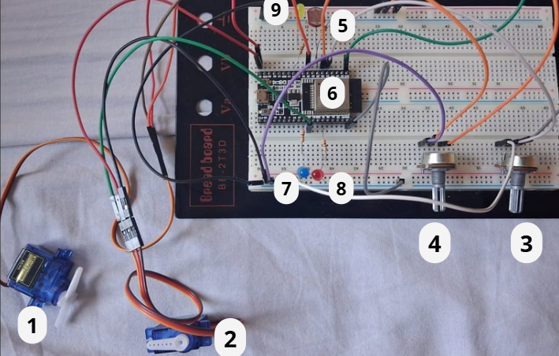
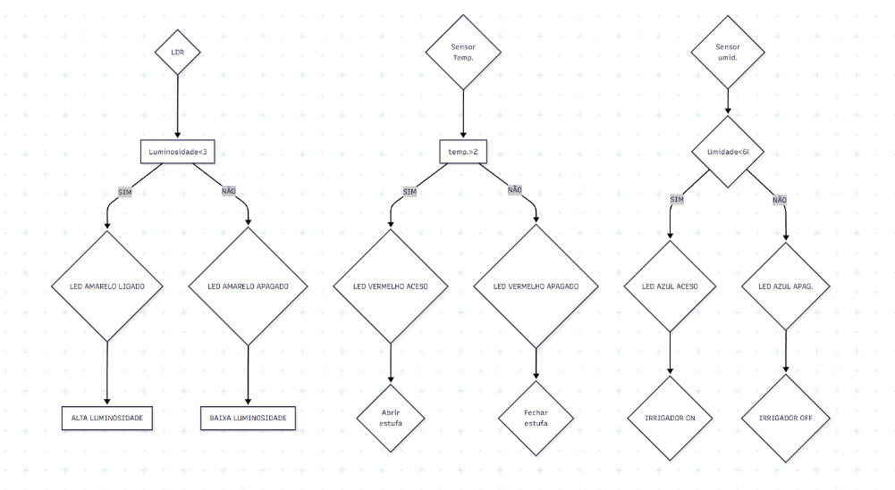

# 🌿 Estufa Inteligente – Projeto Final (1º Semestre)

Este repositório contém o código completo do **sistema de monitoramento de estufa inteligente** com ESP32 e interface web responsiva, desenvolvido como trabalho final da disciplina **"Introdução à Engenharia e ao Método Científico" em conjunto com "Técnicas de Programação"**.

## Alunos:

Aureliano Guimarães Belarmino Filho -	2025006474 
Guilherme Matias Ribeiro de Sá - 2025007678 
Guilherme Mota Meireles de Lima	- 2025007097 
Lucas Fernandes Faria -	2025006840 
Pedro Henrique Pontes -	2025007702 
Phelipe de Oliveira Alves -	2025009242 

## 📘 Descrição Geral

O projeto simula uma **estufa automatizada**, com sensores e atuadores conectados ao ESP32, exibindo os dados em **tempo real** em um **dashboard web moderno e interativo**. O sistema é capaz de:

- 📈 Monitorar temperatura, umidade e luminosidade
- 🚿 Acionar irrigação automaticamente quando necessário
- 🌱 Acionar a cobertura protetora da planta de forma automática ou manual
- 💻 Fornecer uma visualização agradável e funcional dos dados via página web

---

## 🧠 Objetivos do Projeto

- Aplicar conceitos de sensores e atuadores com microcontroladores
- Criar uma interface de supervisão web embarcada no próprio ESP32
- Integrar programação embarcada com frontend (HTML/CSS/JS)
- Estimular a interdisciplinaridade entre Engenharia, Ciência e Software

---

## 👨‍💻 Tecnologias Utilizadas

- ESP32 (WiFi, Servo)
- Arduino IDE (linguagem C/C++)
- HTML5, CSS3 e JavaScript puro
- WebServer embutido no ESP32
- Markdown para documentação

---

## ⚙️ Componentes e Funcionalidades

| Componente       | Função                                               |
|------------------|------------------------------------------------------|
| ESP32            | Microcontrolador com Wi-Fi integrado                 |
| Servo Motor 1    | Representa o irrigador automático                    |
| Servo Motor 2    | Controla a cobertura da planta                       |
| Potenciômetro 1  | Simula sensor de temperatura                         |
| Potenciômetro 2  | Simula sensor de umidade                             |
| LDR              | Simula sensor de luminosidade                        |
| LEDs             | Indicadores visuais de status                        |
| Dashboard Web    | Exibe os dados e permite acionar a cobertura         |

---

## Imagens





---

## 📡 Estrutura do Projeto

```text
estufa-inteligente/
├── arduino/
│   └── estufa_esp32.ino        # Código completo para ESP32
├── web/
│   └── estufa_simulada.html    # Versão do site simulada para navegador
├── assets/                     # Imagens ou ícones (opcional)
├── README.md                   # Este arquivo
